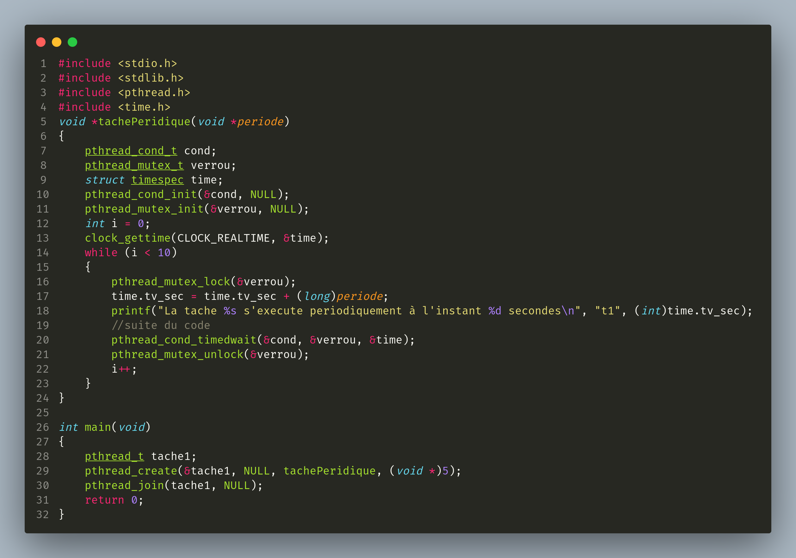

# Compte Rendu STR - TP0

## Exemple 1 : 2 Taches sous POSIX

### Code

### Execution

## Exemple 2 : Priorite et ordonnancement de Taches

### Code 

### Execution 

## Exemple 3 : Exclusion mutuelle

### Code 

### Execution 

## Exemple 4 : Exclusion mutuelle & variable condition

### Code 

### Execution 

## Exemple 5 : Taches periodique sous POSIX

### Code 

### Execution 

## Exemple 6 : Synchronisation entre Taches sous POSIX

### Code 

### Execution 
